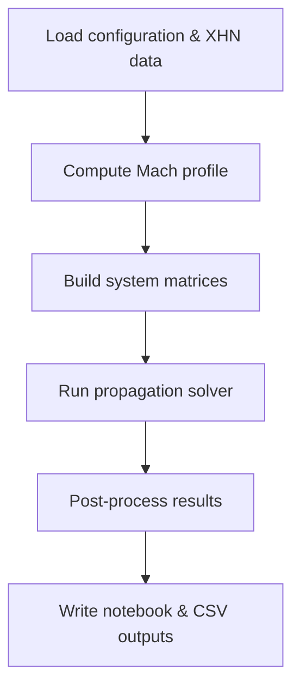

# Thesis Model

## Introduction

This project contains a small acoustic propagation model built around a Jupyter notebook. The code simulates sound fields under different environmental conditions and is primarily used for research and teaching purposes.

## System Architecture

- **thesis_model/** - Python package with the core code. Important modules include:
  - `acoustics.py` – numerical solver and helper routines for the wave propagation model.
  - `mach.py` – functions for Mach number and wind profile calculations.
  - `directivity_utils.py` – utilities for handling loudspeaker directivity data.
  - `xhn_parser.py` – parser for `.xhn` directivity files.
  - `visualization.py` – reusable plotting functions.
- **run_batch.py** – executes `main.ipynb` for a grid of parameters using Papermill.
- **tests/** – unit tests for individual modules.
- Example directivity files (`S33-Arc100m.xhn`, `V36_FullSystem.xhn`) are provided for experimentation.

## Data Flow

Directivity data from `.xhn` files is loaded with `xhn_parser.import_xhn_complex`. Parsed complex amplitudes are combined with model parameters (frequency, source height, wind profile, etc.) before being passed to the propagation solver. Output pressure fields are then available for visualisation or further processing.

## Simulation Workflow



## Configuration

The notebook exposes parameters such as frequency (`freq`), vegetation height (`hv_veg`) and calibration level (`CALIBRATION_SPL_AT_DISTANCE`). When running `run_batch.py` these values are taken from the `PARAM_GRID` table. Additional parameters controlling grid resolution and damping factors can be set directly in the notebook.

## Results

Each batch run produces a notebook in the `outputs/` directory together with `batch_results.csv`. The CSV file collects basic metrics like elapsed time and the effective sound pressure level at 1 m. The individual notebooks contain the full simulation results and figures.

## Running tests

Install dependencies (e.g. `numpy`, `nbformat`, `papermill`) and execute:

```bash
pytest
```

## Batch notebook execution

```bash
pip install papermill pandas nbformat
python run_batch.py
```

Part of this code implements algorithms that have already been published: 

Bill Kayser. “Open Access of a Wide-Angle Parabolic Equation Model for Sound Propagation in a Moving Atmosphere Above an Absorbing and Rough Ground”. In: 10th EAA Convention. Turin, Italy, 2023.
